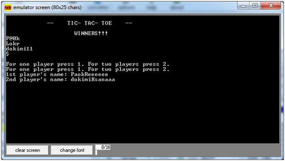
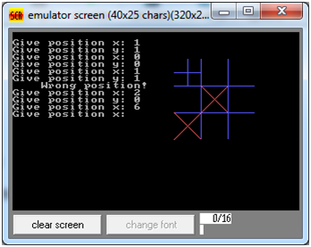
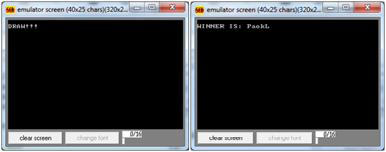
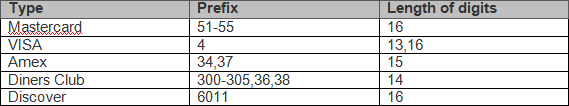
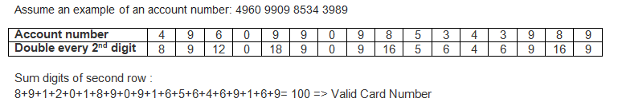
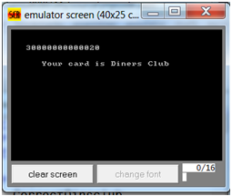

# Tic-tac-toe
  Two-player game with two symbols denoting the two players: x and +. 
  The playing board is a 3x3 square.
  
  
  
  

# Luhn algorithm
  The Luhn algorithm is a simple checksum formula used to validate a variety of   identification numbers, such as credit card numbers.
  
  
  
  
